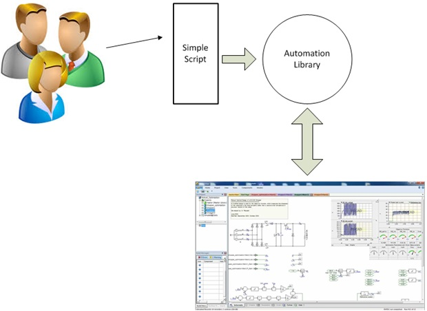

# Introdução

## Objetivo
Ensinar os princípios básicos de programação em Python para poder resolver diferentes tarefas usando esta limguagem de programação. 

## Motivação

No nosso meio académico a gente tem accesso a diferentes softwares de programação pagos. No entanto, na industria muitas vezes não tem disponíveis programas como o Matlab. Neste contexto fica necessário aprender a usar linguagens de programação livres. *R* e *Python* são as linguagens de programação livres mais usadas neste momemto. Por serem livres a comunidade de desenvolvimento é muto grande e constatemente estão liverando pacotes para resolver diversas tarefas. 

Recentemete, fazendo uma pesquisa de programação no *PSCAD* descubri que foi liberada uma livraría de automação ([Automation Library](https://hvdc.ca/pscad/automationlibrary)) que permite rodar várias simulações, mudar parámetros, entre outros, todo desde o *Python*. Como tivesse sido tão bom descubrir isso logo que eu comecei a usar *PSCAD* no mestrado, não queria que vocês tivessem que sofrer o mesmo tento que repetir casos uma e outra vez, esqueceno de mudar algum parámetro, mudar o nome, salvar resultados, entre outros kkk. Faz não muito tempo que eu comecei a aprender *Python*, mas pretendo ensinar para vocês tudo o que eu sei.

Ao final deste curso vocês poderão:

* Renomear centenas de arquivos
* Plotar dados dos experimentos
* Rodar o *PSCAD* desde python e automatizar as simulações.
* Mudar definitivamente para o *Python* kkkkk



# Sobre a linguagem e as ferramentas

Python é uma linguagem interpretada bastante popular no meio científico devido à sua simplicidade e clareza de sintaxe, comunidade extensa, e, principalmente, pacotes prontos e de fácil uso para a maior parte das tarefas. Além disso, é totalmente gratuíta e compatível com Windows, Linux e Mac. Este curso utilizará alguns recursos exclusivos das versões mais recentes do Python, como f-strings, e é recomendado que seja instalada a distribuição [Anaconda](https://www.anaconda.com/download/). 

A vantagem do pacote Anaconda é que ela vem com muitos pacotes científicos pré-instalados. Este material supõe que o leitor esteja utilizando Windows, mas as diferenças entre Windows e Max/Linux, quanto a Python, são mínimas. Após a instalação, é possível iniciar uma seção de um Jupyter Notebook clicando no ícone do Jupyter ou escrevendo *jupyter notebook* no command prompt (cmd). Isso criará uma nova aba no seu navegador (Firefox, Chrome, etc), onde será possível navegar pelo sistema de arquivos, abrir e criar novos arquivos .ipynb.

Para testar se a instalação ocorreu corretamente:

* Apertar CTRL+R e digitar *cmd*
* Digitar *cmd* na barra de endereço de uma janela do windows explorer.
* Digite ```jupyter notebook```, que inicia o servidor dos notebooks (não feche a janela!) ou ```python```, que inicia o interpretador interativo, ou ```ipython```, que inicia o interpretador interativo melhorado.

O ambiente de Jupyter Notebooks, onde este curso foi feito, possibilita utilizar vários *kernels* de várias linguagems. Inclusive, o nome Jupyter vem de *Julia, Python, R*, que são três linguagem com bastante aplicabilidade científica.

Caso apareça alguma mensagem de erro, mencionando que o arquivo não pode ser encontrado, veja nestas guias como alterar a variável path, para o seu SO. [Windows](https://www.computerhope.com/issues/ch000549.htm), [Linux](https://linuxconfig.org/linux-path-environment-variable). Você pode sempre ir com o console até o diretório onde o Python foi instalado e rodar tudo por lá, ao invés de alterar a variável PATH.

É possível utilizar editores de texto ou IDEs alternativas para a criação de scripts, como [Sublim Text](https://www.sublimetext.com/), [Notepad ++](https://notepad-plus-plus.org/download/v7.5.8.html), etc, mas o IDE do Jupyter Notebook possue a vantagem de juntar código e resultados, deixando os dados e a organização do pensamento organizados.

No jupyter notebook é possível baixar o arquivo .py correspondente. Esse arquivo pode ser rodado  no terminal digitando ```python script.py```.

# nbextensions

Há algumas opções extras para Jupyter Notebooks que podem ser instaladas, chamadas de nbextensions. Durante as aulas, utilizarei algumas ferramentas extras dessas extensões. Por exemplo, a criação de um sumário automaticamente faz parte desse pacote. Para instalar o nbextensions, rode o seguinte código no console, caso a variável PATH tenha sido configurada corretamente.

    conda install -c conda-forge jupyter_contrib_nbextensions
    
Depois configure-as pelo browser. 

Neste pacote de extensões é interessante habilitar *scratchpad* e *Variable Inspector* 


# Estrutura do curso

1. 'Hello world', strings
3. Operações matemáticas básicas, Variáveis
2. Estruturas de dados. Listas, tuples, dicionários
4. Loops e condicionais
6. Instalação e uso de pacotes externos
5. Funções. Definições e uso. Métodos internos
8. Introdução a numpy
9. Introdução a pandas
10. Introdução a pyplot
11. Ferramentas avançadas
12. Python e PSCAD

# Recursos para aprendizado

Se vocês fiacam com perguntas que não foram abordadas neste curso os seguentes recursos podem ajudar a encontrar a resposta a suas duvidas:

* [Stack Overflow](https://stackoverflow.com/), uma comunidade de perguntas e respostas. Grande parte de suas dúvidas já foram perguntadas anteriormente, provavelmente com boas respostas.
* [Documentação oficial do Python](https://docs.python.org/3/)
* [Automate the Boring Stuff with Python](https://automatetheboringstuff.com/)

* Youtube:
    * [Tutorial por Sendtex](https://www.youtube.com/watch?v=oVp1vrfL_w4&list=PLQVvvaa0QuDe8XSftW-RAxdo6OmaeL85M)
    * [Tutorial por Socratica](https://www.youtube.com/watch?v=bY6m6_IIN94&list=PLi01XoE8jYohWFPpC17Z-wWhPOSuh8Er-)
*  [PSCAD Automation reference](https://hvdc.ca/knowledge-base/topic:242/v:)

# Promessas

Talvez você consiga utilizar essa ferramenta adequadamente para resolver seus problemas, talvez não. Eu sou só um aluno de doutorado tentando transmitir o que eu sei e ajudar vocês. Não mostrarei como resolver os problemas de todos, mas sim algumas maneiras de resolver alguns problemas, depois você altera e aplica esses métodos para seus problemas pessoais.
